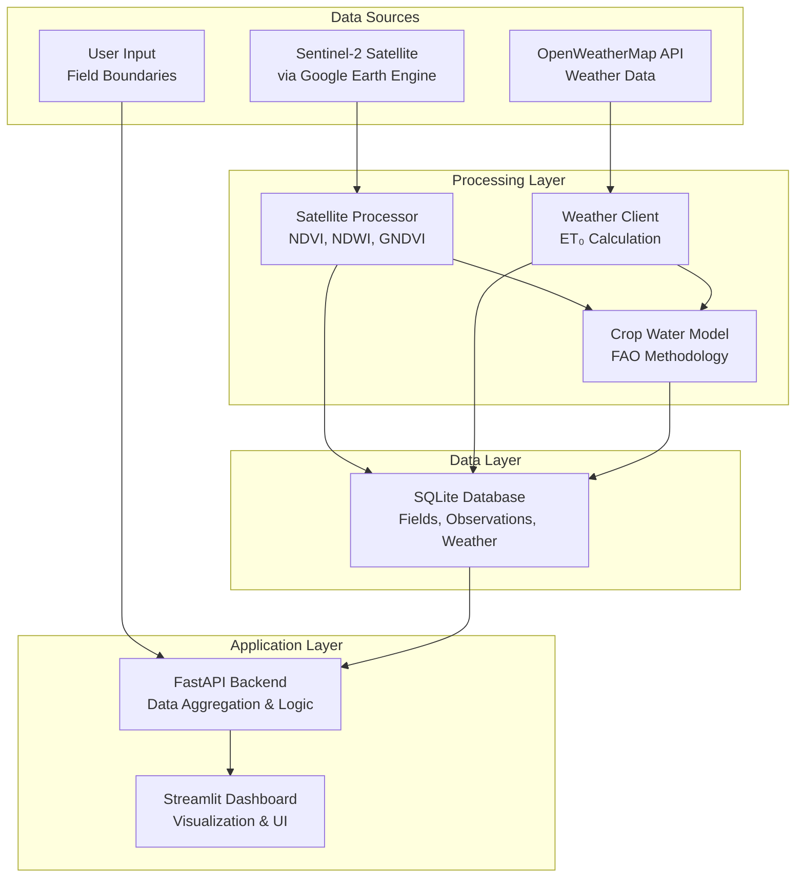

# Design Document

## Overview

AgriMonitor Lite is a lightweight agricultural monitoring system that combines satellite imagery analysis with weather data integration to provide farmers with actionable crop health insights. The system leverages free data sources and open-source technologies to deliver a cost-effective solution for precision agriculture.

The architecture follows a modular design with clear separation between data acquisition, processing, storage, and presentation layers. The system processes Sentinel-2 satellite imagery through Google Earth Engine, integrates weather data from OpenWeatherMap, applies FAO-approved crop water models, and presents insights through an interactive Streamlit dashboard.

## Architecture



## Components and Interfaces

### Satellite Processing Component

**Purpose**: Process Sentinel-2 satellite imagery to extract vegetation health indicators

**Key Classes**:
- `GEESatelliteProcessor`: Main class for Google Earth Engine integration
- `VegetationIndexCalculator`: Computes NDVI, NDWI, and GNDVI indices
- `HealthScoreCalculator`: Combines indices into unified health score

**External Dependencies**:
- Google Earth Engine Python API (`earthengine-api`)
- GeoPandas for spatial operations (`geopandas`)
- Rasterio for raster processing (`rasterio`)

**Key Methods**:
```python
class GEESatelliteProcessor:
    def authenticate(self, service_account_path: str) -> None
    def get_field_timeseries(self, field_geojson: dict, start_date: str, end_date: str) -> pd.DataFrame
    def calculate_health_score(self, field_geojson: dict) -> dict
    def filter_cloud_coverage(self, collection: ee.ImageCollection, max_cloud_percent: float) -> ee.ImageCollection
```

### Weather Data Component

**Purpose**: Fetch and process weather data for evapotranspiration calculations

**Key Classes**:
- `WeatherDataClient`: OpenWeatherMap API integration
- `EvapotranspirationCalculator`: FAO Penman-Monteith implementation
- `WeatherDataProcessor`: Data validation and caching

**External Dependencies**:
- Requests library for HTTP calls (`requests`)
- PyETO library for ET calculations (`pyeto`)

**Key Methods**:
```python
class WeatherDataClient:
    def get_current_weather(self, lat: float, lon: float) -> dict
    def get_forecast(self, lat: float, lon: float, days: int = 5) -> list
    def calculate_et0(self, weather_data: dict) -> float
    def cache_weather_data(self, data: dict, cache_duration: int = 3600) -> None
```

### Crop Water Model Component

**Purpose**: Calculate irrigation requirements using FAO methodology

**Key Classes**:
- `CropWaterModel`: Main irrigation calculation logic
- `CropCoefficientManager`: Manages Kc values for different crops and growth stages
- `SoilWaterBalance`: Tracks soil moisture and water depletion

**Crop Coefficients Database**:
```python
CROP_COEFFICIENTS = {
    'wheat': {'initial': 0.3, 'development': 0.75, 'mid_season': 1.15, 'late_season': 0.45},
    'rice': {'initial': 1.05, 'development': 1.2, 'mid_season': 1.2, 'late_season': 0.9},
    'maize': {'initial': 0.3, 'development': 0.8, 'mid_season': 1.2, 'late_season': 0.6},
    'cotton': {'initial': 0.35, 'development': 0.75, 'mid_season': 1.15, 'late_season': 0.75},
    'soybean': {'initial': 0.3, 'development': 0.7, 'mid_season': 1.15, 'late_season': 0.5}
}
```

### Database Component

**Purpose**: Persistent storage for all system data

**Schema Design**:
- `fields`: Field definitions with geometry and crop information
- `satellite_observations`: Time-series vegetation index data
- `weather_data`: Historical and forecast weather information
- `recommendations`: Generated irrigation and management recommendations
- `alerts`: System-generated alerts and their status

**Key Features**:
- SQLite for simplicity and portability
- Indexed time-series queries for performance
- Foreign key constraints for data integrity
- Unique constraints to prevent duplicate observations

### Backend API Component

**Purpose**: Coordinate data processing and provide REST endpoints

**Key Classes**:
- `FieldManager`: CRUD operations for field management
- `DataAggregator`: Combines satellite, weather, and model data
- `AlertEngine`: Generates and manages alerts based on thresholds
- `RecommendationEngine`: Creates actionable recommendations

**API Endpoints**:
```python
# Field Management
POST /api/fields - Create new field
GET /api/fields - List all fields
GET /api/fields/{id} - Get field details
PUT /api/fields/{id} - Update field
DELETE /api/fields/{id} - Delete field

# Data Retrieval
GET /api/fields/{id}/health - Current health status
GET /api/fields/{id}/timeseries - Historical data
GET /api/fields/{id}/recommendations - Current recommendations
GET /api/alerts - Active alerts
```

### Dashboard Component

**Purpose**: Interactive web interface for data visualization and system control

**Key Features**:
- Real-time field health overview
- Interactive maps with health-coded field markers
- Time-series charts for trend analysis
- Alert management interface
- Recommendation display and acknowledgment

**Technology Stack**:
- Streamlit for rapid dashboard development
- Plotly for interactive charts
- Folium for interactive maps
- Pandas for data manipulation

## Data Models

### Field Model
```python
@dataclass
class Field:
    id: int
    name: str
    crop_type: str
    area_hectares: float
    geometry: dict  # GeoJSON polygon
    field_capacity: float  # % soil moisture
    wilting_point: float   # % soil moisture
    planting_date: datetime
    growth_stage: str
    created_at: datetime
```

### Satellite Observation Model
```python
@dataclass
class SatelliteObservation:
    id: int
    field_id: int
    observation_date: date
    ndvi: float
    ndwi: float
    gndvi: float
    health_score: float
    cloud_cover: float
    image_source: str
```

### Weather Data Model
```python
@dataclass
class WeatherData:
    id: int
    field_id: int
    date: date
    temperature_max: float
    temperature_min: float
    precipitation: float
    humidity: float
    wind_speed: float
    et0: float  # Reference evapotranspiration
```

### Recommendation Model
```python
@dataclass
class Recommendation:
    id: int
    field_id: int
    recommendation_type: str  # 'irrigation', 'fertilization', 'scouting'
    urgency: str  # 'low', 'medium', 'high'
    action_text: str
    reasoning: str
    estimated_cost: float
    expected_benefit: str
    generated_at: datetime
    acknowledged: bool
```

Now I'll use the prework tool to analyze the acceptance criteria before writing the correctness properties:
## Correctness Properties

*A property is a characteristic or behavior that should hold true across all valid executions of a system—essentially, a formal statement about what the system should do. Properties serve as the bridge between human-readable specifications and machine-verifiable correctness guarantees.*

### Property 1: Field Creation and Persistence
*For any* valid field data (name, crop type, area, geometry), creating a field should result in a database record that contains all provided information and can be immediately retrieved.
**Validates: Requirements 1.1, 1.5**

### Property 2: GeoJSON Parsing Consistency
*For any* valid GeoJSON polygon, parsing and storing the geometry should result in boundary data that accurately represents the original coordinates.
**Validates: Requirements 1.2**

### Property 3: Coordinate Validation Boundaries
*For any* coordinate pair, validation should accept coordinates within valid geographic ranges (-90 to 90 latitude, -180 to 180 longitude) and reject coordinates outside these ranges.
**Validates: Requirements 1.3**

### Property 4: Health Score Calculation
*For any* set of vegetation indices (NDVI, NDWI, GNDVI), the health score calculation should use the weighted formula (NDVI×0.4 + NDWI×0.3 + GNDVI×0.3) and produce a result bounded between 0 and 100.
**Validates: Requirements 2.4, 2.5**

### Property 5: Satellite Data Processing Pipeline
*For any* registered field, the satellite processor should automatically fetch imagery, filter out high cloud cover (>20%), compute all three vegetation indices, and store results with proper field and date references.
**Validates: Requirements 2.1, 2.2, 2.3, 2.6**

### Property 6: Weather Data Retrieval
*For any* valid field location, the weather client should fetch a 5-day forecast and extract temperature, humidity, precipitation, and wind speed data.
**Validates: Requirements 3.1, 3.2**

### Property 7: Evapotranspiration Calculation
*For any* weather data set, the ET₀ calculation should follow FAO Penman-Monteith methodology and produce results consistent with reference implementations.
**Validates: Requirements 3.3**

### Property 8: Weather Data Caching
*For any* weather data request, subsequent requests for the same location within 1 hour should return cached data without making new API calls.
**Validates: Requirements 3.4**

### Property 9: Irrigation Threshold Triggering
*For any* field with soil moisture below 50% of available water capacity, the crop water model should recommend irrigation with specific amount and timing.
**Validates: Requirements 4.3, 4.4**

### Property 10: Crop Coefficient Application
*For any* crop type and growth stage combination, the irrigation calculation should use the correct FAO-approved crop coefficient from the predefined database.
**Validates: Requirements 4.1**

### Property 11: Comprehensive Alert Generation
*For any* field condition that meets alert criteria (health score below threshold, NDVI drop >15% in 7 days, or critical soil moisture), the system should generate an alert with appropriate urgency level and display it in the dashboard.
**Validates: Requirements 6.1, 6.2, 6.3, 6.4**

### Property 12: Alert Acknowledgment Tracking
*For any* alert that is acknowledged by a user, the system should update the alert status and maintain a complete history of the acknowledgment.
**Validates: Requirements 6.5**

### Property 13: Database Integrity
*For any* data storage operation, the system should maintain proper schema compliance, prevent duplicates for satellite observations (same field and date), and enforce referential integrity between related records.
**Validates: Requirements 7.1, 7.2, 7.3**

### Property 14: API Resilience
*For any* external API failure, the system should implement exponential backoff retry logic, handle rate limits by queuing requests, validate responses before processing, and provide clear error messages for authentication failures.
**Validates: Requirements 8.2, 8.3, 8.4, 8.5**

### Property 15: Configuration Management
*For any* configuration change (alert thresholds, crop parameters, environment variables), the system should validate values are within acceptable ranges, apply changes without restart, and use the updated configuration in subsequent operations.
**Validates: Requirements 9.1, 9.2, 9.3, 9.4, 9.5**

### Property 16: Comprehensive Error Handling
*For any* error condition (system errors, API failures, validation failures, component failures), the system should log detailed information with timestamp and context, provide specific error messages, and implement graceful degradation for non-critical failures.
**Validates: Requirements 10.1, 10.2, 10.3, 10.4**

### Property 17: Dashboard Data Display
*For any* field in the system, the dashboard should display current health scores, NDVI values, last update timestamps, and render interactive maps with health-coded markers.
**Validates: Requirements 5.1, 5.2, 5.3**

### Property 18: Time-Series Chart Generation
*For any* field with historical data, the dashboard should generate time-series charts for NDVI, soil moisture, and weather data covering the requested time period.
**Validates: Requirements 5.4**

## Error Handling

### API Error Handling
- **Google Earth Engine**: Implement service account authentication with proper credential validation
- **OpenWeatherMap**: Handle rate limits (1000 calls/day) with request queuing and caching
- **Network Failures**: Exponential backoff retry with maximum retry limits
- **Invalid Responses**: Schema validation before data processing

### Data Validation Errors
- **GeoJSON Validation**: Verify polygon structure and coordinate validity
- **Coordinate Range Validation**: Ensure latitude (-90 to 90) and longitude (-180 to 180) bounds
- **Crop Type Validation**: Verify against supported crop database
- **Date Range Validation**: Ensure observation dates are within reasonable bounds

### System Resource Errors
- **Database Connection Failures**: Connection pooling with retry logic
- **Memory Constraints**: Batch processing for large datasets
- **Disk Space**: Monitoring and cleanup of temporary files
- **Processing Timeouts**: Configurable timeout limits for long-running operations

### Graceful Degradation
- **Satellite Data Unavailable**: Use last known values with staleness indicators
- **Weather API Down**: Fall back to historical averages for the region
- **Database Issues**: Cache critical data in memory temporarily
- **Partial Component Failure**: Continue operation with reduced functionality

## Testing Strategy

### Dual Testing Approach
The system will employ both unit testing and property-based testing to ensure comprehensive coverage:

**Unit Tests**: Verify specific examples, edge cases, and error conditions
- Test specific field creation scenarios
- Test known vegetation index calculations
- Test API error responses
- Test database constraint violations
- Test configuration validation edge cases

**Property Tests**: Verify universal properties across all inputs
- Test field creation with randomly generated valid data
- Test health score calculations with random vegetation indices
- Test coordinate validation with random coordinate pairs
- Test irrigation recommendations with random soil moisture levels
- Test alert generation with random threshold conditions

### Property-Based Testing Configuration
- **Testing Framework**: Use Hypothesis for Python property-based testing
- **Test Iterations**: Minimum 100 iterations per property test
- **Test Tagging**: Each property test must reference its design document property
- **Tag Format**: `# Feature: agrimonitor-lite, Property {number}: {property_text}`

### Integration Testing
- **End-to-End Workflows**: Test complete data flow from satellite processing to dashboard display
- **API Integration**: Test actual connections to Google Earth Engine and OpenWeatherMap (with test accounts)
- **Database Integration**: Test with real SQLite database operations
- **Dashboard Integration**: Test Streamlit interface with real data

### Performance Testing
- **Satellite Processing**: Verify processing times for typical field sizes
- **Database Queries**: Test query performance with realistic data volumes
- **Dashboard Responsiveness**: Ensure dashboard loads within acceptable time limits
- **Memory Usage**: Monitor memory consumption during batch processing

### Validation Testing
- **Ground Truth Comparison**: Compare NDVI calculations with known reference values
- **FAO Model Validation**: Verify irrigation calculations against FAO reference implementations
- **Weather Data Accuracy**: Cross-validate weather data with multiple sources
- **Alert Accuracy**: Test alert generation against known field conditions

The testing strategy ensures that both specific examples work correctly (unit tests) and that universal properties hold across all possible inputs (property tests), providing comprehensive validation of system correctness.